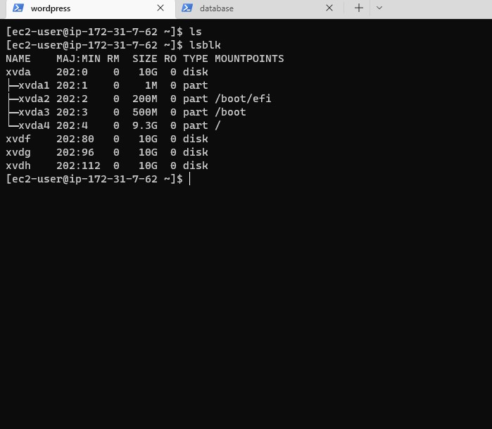
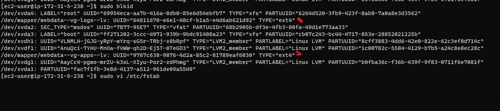
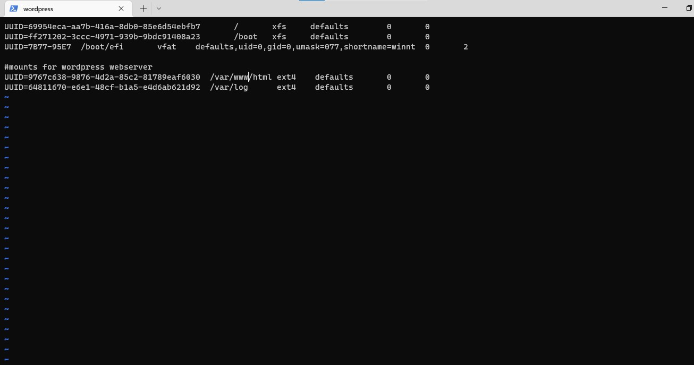
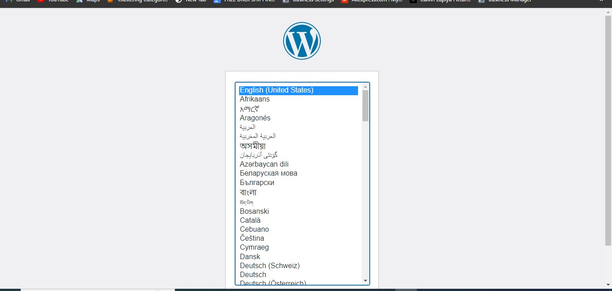
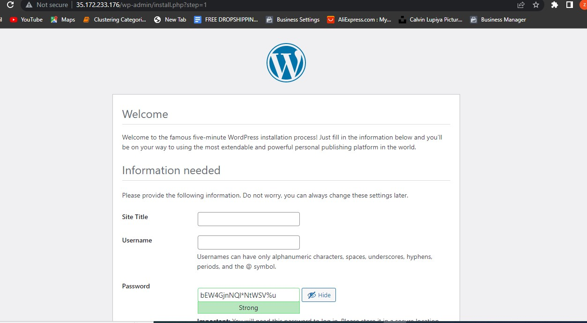
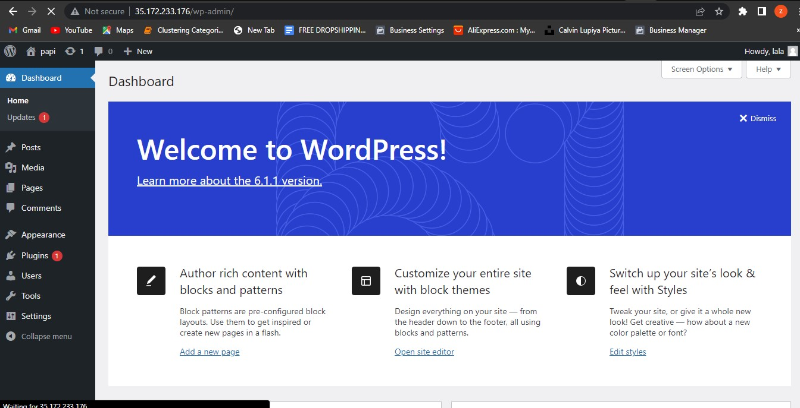

# Implementing a Web Solution With Wordpress
### Your client-server architecture setup will be:
- Your PC
- An ec2 linux instance as a web server
- An EC2 linux as a database

### After launching your servers(Redhat OS), create 3 volumes in the same AZ as your instances.(10GiB). Proceed to attach all 3 volumes one by one to your web server instance
```create volumes```


### When attaching the volume ensure your web server is in the same AZ as the volume


### use the $lsblk command to see all block devices attached to the server. Your newly added block devices xvdf, xvdg and xvdh should be there


### Use $df -h to see all the mounts on your server and the free space available.
`df -h`

### Use gdisk to create a single partition of each of the 3 disks. i.e xvdf, xvdg, xvdh
`sudo gdisk /dev/xvdf`


`sudo gdisk /dev/xvdg`


`sudo gdisk /dev/xvdh`


### Use $lsblk to view the new configured partitions o the 3 disks.


### Install lvm2 package and proceed to check for all available partitions
`sudo yum install lvm2`

`sudo lvmdiskscan`


### mark each of the 3 disks as physical volume(PVs) to be used by LVM with pvcreate. Verify that the PVs were created
```
sudo pvcreate /dev/xvdf1
sudo pvcreate /dev/xvdg1
sudo pvcreate /dev/xvdh1
```
`sudo pvs`


### Add all 3 PVs to a volume group(VG) named "webdata-vg" using vgcreate utility and verify the this.
`sudo vgcreate webdata-vg /dev/xvdh1 /dev/xvdg1 /dev/xvdf1`

`sudo vgs` 


### create 2 logical volumes; apps-lv and logs-lv. apps-lv will store data for the website while logs-lv will store data for logs. Use half of the PV size to create apps-lv and the remaining space on the PV to create logs-lv. Verify this is done with $sudo lvs
`sudo lvcreate -n apps-lv -L 14G webdata-vg`

`sudo lvcreate -n logs-lv -L 14G webdata-vg`

`sudo lvs`


### view your entire setup
`sudo vgdisplay -v #view complete setup - VG, PV, and LV
sudo lsblk`


### Format both logical volumes with the ext4 file system
`sudo mkfs -t ext4 /dev/webdata-vg/apps-lv`

`sudo mkfs -t ext4 /dev/webdata-vg/logs-lv`


### Create /var/www/html directory to store website files
`sudo mkdir -p /var/www/html`

### Create /home/recovery/logs to store backup of log data
`sudo mkdir -p /home/recovery/logs`

### Mount /var/www/html on apps-lv logical volume
`sudo mount /dev/webdata-vg/apps-lv /var/www/html/`

### Use the rsync utility to backup all files in the log directory in the /home/recovery/logs. You must do this before mounting the file system.
`sudo rsync -av /var/log/. /home/recovery/logs/`


### Mount /var/log on the logs-lv logical volume
`sudo mount /dev/webdata-vg/logs-lv /var/log`

### Restore log files back into /var/log directory
`sudo rsync -av /home/recovery/logs/. /var/log`

### Update the /etc/fstab file so that the mounted volumes automatically persist whenever the server restarts. First we get the uuid of the device as it will be used in the /etc/fstab
`sudo blkid`


`sudo vi /etc/fstab`


### Test the configuration and reload the daemon
` sudo mount -a`

`sudo systemctl daemon-reload`

### Verify everything is running
`df -h`


# STEP 2: Prepare the Database Server

### launch the 2nd instance you created i.e the database server

### Repeat the steps doe for web server but instead of apps-lv, create db-lv and mount it to /db directory instead of /var/lib/html

# STEP 3; Install wordpress on the web server instance

### Install wget and apache
`sudo yum -y update`

`sudo yum -y install wget httpd php php-mysqlnd php-fpm php-json`

### Start the apache 
`sudo systemctl enable httpd`

`sudo systemctl enable httpd`

### Install php and all it's dependencies
`sudo yum install https://dl.fedoraproject.org/pub/epel/epel-release-latest-8.noarch.rpm`

`sudo yum install yum-utils http://rpms.remirepo.net/enterprise/remi-release-8.rpm`

`sudo yum module list php`

`sudo yum module reset php`

`sudo dnf module enable php:8.1`
`sudo dnf module -y install php:8.1/common`

`sudo yum install php php-opcache php-gd php-curl php-mysqlnd`

`sudo systemctl start php-fpm`

`sudo systemctl enable php-fpm`

`setsebool -P httpd_execmem 1`

### Restart apache
`sudo systemctl restart httpd`

### Download wordpress and copy it to /var/www/html
` mkdir wordpress`

`cd wordpress`

`sudo wget http://wordpress.org/latest.tar.gz`

`sudo tar xzvf latest.tar.gz`

`sudo rm -rf latest.tar.gz`
`cp wordpress/wp-config-sample.php wordpress/wp-config.php`

`cp -R wordpress /var/www/html/`

### Configure SElinux policies
`sudo chown -R apache:apache /var/www/html/wordpress`

`sudo chcon -t httpd_sys_rw_content_t /var/www/html/wordpress -R`

`sudo setsebool -P httpd_can_network_connect=1`

### Install mysql on Database server
`sudo yum update`
`sudo yum install mysql-server`
`sudo systemctl restart mysqld`

`sudo systemctl enable mysqld`


# configure DB to work with wordpress
`sudo mysql`

`CREATE DATABASE wordpress;`

`CREATE USER 'wordpress'@'%' IDENTIFIED WITH mysql_native_password BY 'wordpress';`

` GRANT ALL PRIVILEGES ON *.* TO 'wordpress'@'%' WITH GRANT OPTION;`

`FLUSH PRIVILEGES;`

### See all users and hosts
`select user, host from mysql.user;`


`SHOW DATABASES;`

`exit`


### Configure MySQL server to allow connections from remote hosts i.e set the bind address
`sudo vi /etc/my.cnf`


### Restart the service
`sudo systemctl restart mysqld`
# Configure wordpress to connect to remote database

### On your webserver configure your config.php file. When configuring the hostname of the databse, you can use the pricate ip-address of the database server as it resides in the same subnet with the web server.
`vi wp-config.php`
`sudo systemctl restart httpd`

### Next you disable the apache default web page
`sudo mv /etc/httpd/conf.d/welcome.conf /etc/httpd/conf.d/welcome.conf_backup`
### On your DB server security group, open port 3306 and the source should be your wordpress server ip address
### On your wordpresss server security group open port 80 with the source open to all trafic
  

### First install mysql client and test that you can connect to your DB server from your web server

`sudo yum install mysql`

`sudo mysql -u wordpress -p -h <DB server public address>`

### Verify that you successfully connected 
`SHOW DATABASES`


### access from your browser the link to your WordPress
 `http://<Web-Server-Public-IP-Address>/wordpress/`
 
 
 
